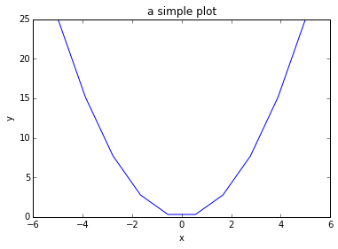

This is just a test on how well ipython notebooks can be converted to blog posts. 
The conversion can be done very easily by running
`ipython nbconvert <filename>.ipynb --to markdown`. 
This creates the .md file and a folder containing all the plot images. The basic functionality is there as you can see below. But there are some issues. 

* latex formulas are not converted to images $$ y = x^2 $$. 

  **\[edit\]**
  
  I was able to fix this issue thanks to the post by [Christopher Poole](http://christopherpoole.github.io/using-mathjax-on-github-pages/). Apparently there is a javascript library, which is able to render latex called [MathJax](https://www.mathjax.org/). The solution is incredibly simple just add the following lines to your `_layouts/post.html`.
  
  ```javascript
      <script type="text/javascript"
        src="http://cdn.mathjax.org/mathjax/latest/MathJax.js?config=TeX-AMS-MML_HTMLorMML">
      </script>
  ```
  
  **\[/edit\]**
  
* to enable code to be syntax highlighted it requires three ticks and the language name (python) at the beginning of the code block and three ticks at the end. Currently i have to add them manually. Here is the result with and without ticks.

without:

    from pylab import *


    %matplotlib inline


    x = linspace(-5, 5, 10)
    y = x ** 2


    figure()
    plot(x, y, 'blue')
    xlabel('x')
    ylabel('y')
    title('a simple plot')
    show()

with:

```python
    from pylab import *


    %matplotlib inline


    x = linspace(-5, 5, 10)
    y = x ** 2


    figure()
    plot(x, y, 'blue')
    xlabel('x')
    ylabel('y')
    title('a simple plot')
    show()
```

* The last issue are the images. I need to put them into the *images* folder, but the default exported path is wrong. This issue is easily fixed, i just need to add *.../images* to every image path, which can be done by a script.




    
